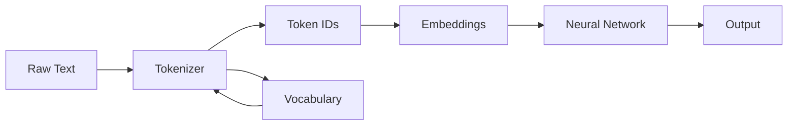
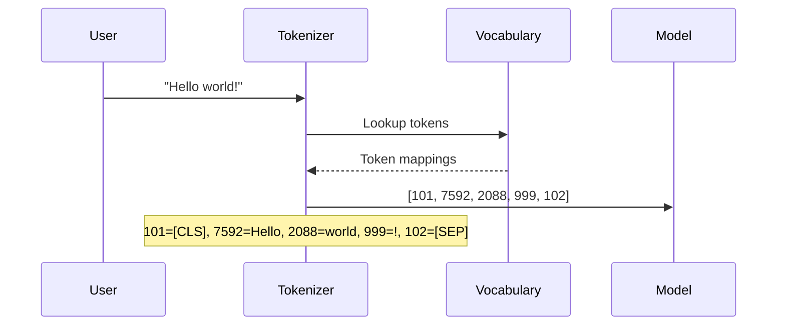
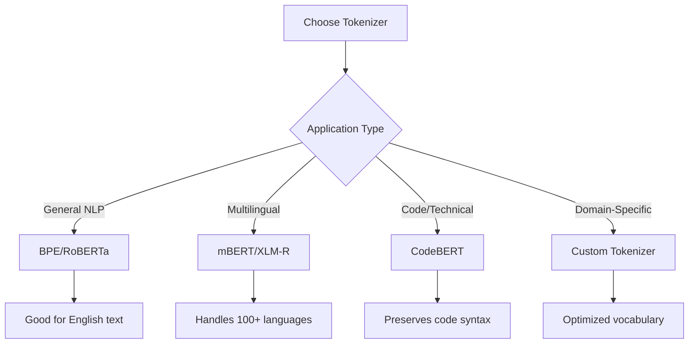

# Article 5: Tokenization - Converting Text to Numbers for Neural Networks

## Table of Contents

1. [Learning Objectives](#learning-objectives)
2. [Introduction: Why Tokenization Matters](#introduction-why-tokenization-matters)
3. [Core Concepts: Text to Tokens](#core-concepts-text-to-tokens)
4. [Tokenization Algorithms](#tokenization-algorithms)
5. [Implementation Guide](#implementation-guide)
6. [Production Considerations](#production-considerations)
7. [Key Takeaways](#key-takeaways)

## Learning Objectives

By the end of this tutorial, you will:

- Understand how tokenization converts text into numerical representations
- Compare three major tokenization algorithms: BPE, WordPiece, and Unigram
- Implement tokenization using Hugging Face's transformers library
- Handle common edge cases in production systems
- Debug tokenization issues effectively
- Build custom tokenizers for specialized domains

## Introduction: Why Tokenization Matters

Neural networks process numbers, not text. Tokenization converts human language into numerical sequences that models can understand. This conversion determines how well your model performs.

### Real-World Impact

Consider these business scenarios:

1. **Customer Support**: A chatbot needs to distinguish between "can't login" and "cannot log in"
2. **Financial Analysis**: A system must recognize "Q4 2023" as one unit, not three
3. **Medical Records**: "Myocardial infarction" must stay together to preserve meaning

Poor tokenization leads to:
- Misunderstood user intent
- Incorrect data extraction
- Higher computational costs
- Reduced model accuracy

### System Architecture Overview



**Architecture Explanation**: Text flows through the tokenizer, which converts it to numerical IDs using a vocabulary. These IDs become embeddings that feed into the neural network. The vocabulary maps between text pieces and numbers.

## Core Concepts: Text to Tokens

### What Are Tokens?

Tokens are the basic units of text that models process. They can be:
- Whole words: "cat" → ["cat"]
- Subwords: "unhappy" → ["un", "happy"]
- Characters: "hi" → ["h", "i"]

### The Tokenization Process



**Process Explanation**: The user provides text. The tokenizer looks up each piece in its vocabulary to find numerical IDs. Special tokens like [CLS] and [SEP] mark the beginning and end. The model receives these numbers for processing.

### Basic Implementation

This code demonstrates fundamental tokenization using BERT:

```python
from transformers import AutoTokenizer
import logging

# Configure logging
logging.basicConfig(level=logging.INFO)
logger = logging.getLogger(__name__)

def demonstrate_basic_tokenization():
    """
    Shows how tokenization converts text to numbers.
    This example uses BERT's tokenizer to process a simple sentence.
    """
    # Load BERT tokenizer
    tokenizer = AutoTokenizer.from_pretrained('bert-base-uncased')
    
    # Sample text
    text = "Tokenization converts text to numbers."
    
    # Tokenize
    tokens = tokenizer.tokenize(text)
    token_ids = tokenizer.encode(text)
    
    # Display results
    logger.info(f"Original text: {text}")
    logger.info(f"Tokens: {tokens}")
    logger.info(f"Token IDs: {token_ids}")
    
    # Show token-to-ID mapping
    for token, token_id in zip(tokens, token_ids[1:-1]):  # Skip special tokens
        logger.info(f"  '{token}' → {token_id}")
    
    return tokens, token_ids

# Run the demonstration
tokens, ids = demonstrate_basic_tokenization()
```

**Code Explanation**: This function loads BERT's tokenizer and processes a sentence. It shows both the text tokens and their numerical IDs. The mapping reveals how each word becomes a number. Special tokens [CLS] and [SEP] frame the sequence.

### Function Analysis: demonstrate_basic_tokenization

**Purpose**: Demonstrates the fundamental text-to-number conversion process.

**Parameters**:
| Parameter | Type | Description |
|-----------|------|-------------|
| None | - | This function takes no parameters |

**Returns**:
| Type | Description |
|------|-------------|
| tuple | (tokens: list of strings, token_ids: list of integers) |

**Context**: Called as an entry point to understand basic tokenization. Used in tutorials and debugging.

**Side Effects**: 
- Logs tokenization results to console
- Downloads BERT vocabulary on first run

## Tokenization Algorithms

Three main algorithms power modern tokenization. Each balances vocabulary size against sequence length.

### Algorithm Comparison

| Algorithm | Used By | Approach | Vocabulary Size | Best For |
|-----------|---------|----------|-----------------|----------|
| BPE | GPT, RoBERTa | Frequency-based merging | 30k-50k | General text |
| WordPiece | BERT | Likelihood maximization | 30k | Multilingual |
| Unigram | T5, mBART | Probabilistic model | 32k-250k | Flexibility |

### Byte Pair Encoding (BPE)

BPE builds vocabulary by merging frequent character pairs:

```python
def demonstrate_bpe_tokenization():
    """
    Demonstrates BPE tokenization using RoBERTa.
    BPE handles unknown words by breaking them into known subwords.
    """
    tokenizer = AutoTokenizer.from_pretrained('roberta-base')
    
    # Test words showing BPE behavior
    test_words = [
        "tokenization",      # Common word
        "pretokenization",   # Compound word
        "cryptocurrency",    # Technical term
        "antidisestablish"   # Rare word
    ]
    
    logger.info("=== BPE Tokenization (RoBERTa) ===")
    
    for word in test_words:
        tokens = tokenizer.tokenize(word)
        ids = tokenizer.encode(word, add_special_tokens=False)
        
        logger.info(f"\n'{word}':")
        logger.info(f"  Tokens: {tokens}")
        logger.info(f"  Count: {len(tokens)}")
        
        # Show how BPE splits the word
        if len(tokens) > 1:
            logger.info(f"  Split pattern: {' + '.join(tokens)}")
    
    return tokenizer
```

**Code Explanation**: BPE tokenization breaks words into subword units based on frequency. Common words stay whole, while rare words split into known pieces. This enables handling of any word, even those not in training data.

### WordPiece Tokenization

WordPiece uses statistical likelihood to create subwords:

```python
def demonstrate_wordpiece_tokenization():
    """
    Shows WordPiece tokenization used by BERT.
    Note the ## prefix marking word continuations.
    """
    tokenizer = AutoTokenizer.from_pretrained('bert-base-uncased')
    
    # Same test words for comparison
    test_words = [
        "tokenization",
        "pretokenization",
        "cryptocurrency",
        "antidisestablish"
    ]
    
    logger.info("\n=== WordPiece Tokenization (BERT) ===")
    
    for word in test_words:
        tokens = tokenizer.tokenize(word)
        
        logger.info(f"\n'{word}':")
        logger.info(f"  Tokens: {tokens}")
        
        # Explain ## notation
        if any(t.startswith('##') for t in tokens):
            logger.info("  Note: ## indicates continuation of previous token")
            
            # Reconstruct word from pieces
            reconstructed = tokens[0]
            for token in tokens[1:]:
                reconstructed += token.replace('##', '')
            logger.info(f"  Reconstructed: {reconstructed}")
    
    return tokenizer
```

**Code Explanation**: WordPiece marks non-initial subwords with ##. This preserves word boundaries, helping models understand token relationships. The reconstruction shows how pieces combine back into words.

### Algorithm Selection Guide



**Decision Flow**: Start with your application type. General NLP tasks work well with BPE. Multilingual applications need tokenizers trained on diverse languages. Technical domains benefit from specialized vocabularies.

## Implementation Guide

### Setting Up Your Environment

First, install required dependencies:

```python
# requirements.txt
transformers==4.36.0
torch==2.1.0
tokenizers==0.15.0
datasets==2.16.0
```

### Complete Tokenization Pipeline

This section demonstrates a production-ready tokenization pipeline:

```python
class TokenizationPipeline:
    """
    Production-ready tokenization pipeline with error handling.
    Supports batch processing and various output formats.
    """
    
    def __init__(self, model_name='bert-base-uncased', max_length=512):
        """
        Initialize tokenizer with specified model.
        
        Parameters:
        -----------
        model_name : str
            Hugging Face model identifier
        max_length : int
            Maximum sequence length
        """
        self.tokenizer = AutoTokenizer.from_pretrained(model_name)
        self.max_length = max_length
        logger.info(f"Initialized tokenizer: {model_name}")
    
    def tokenize_single(self, text, return_offsets=False):
        """
        Tokenize a single text string.
        
        Parameters:
        -----------
        text : str
            Input text to tokenize
        return_offsets : bool
            Whether to return character offset mappings
            
        Returns:
        --------
        dict : Tokenization results including input_ids, attention_mask
        """
        if not text:
            logger.warning("Empty text provided")
            text = ""
        
        try:
            encoding = self.tokenizer(
                text,
                truncation=True,
                max_length=self.max_length,
                padding='max_length',
                return_offsets_mapping=return_offsets,
                return_tensors='pt'
            )
            
            logger.info(f"Tokenized {len(text)} chars into {encoding['input_ids'].shape[1]} tokens")
            return encoding
            
        except Exception as e:
            logger.error(f"Tokenization failed: {str(e)}")
            raise
```

**Implementation Details**: This class encapsulates tokenization logic with proper error handling. It supports both single texts and batches. The offset mapping feature enables token-to-character alignment for tasks like NER.

### Batch Processing

Efficient batch processing reduces computational overhead:

```python
def tokenize_batch(self, texts, show_progress=True):
    """
    Efficiently tokenize multiple texts.
    
    Parameters:
    -----------
    texts : list of str
        Input texts to process
    show_progress : bool
        Display progress information
        
    Returns:
    --------
    dict : Batched tokenization results
    """
    if not texts:
        logger.warning("Empty text list provided")
        return None
    
    # Clean texts
    texts = [text if text else "" for text in texts]
    
    # Process in batches for memory efficiency
    batch_size = 32
    all_encodings = []
    
    for i in range(0, len(texts), batch_size):
        batch = texts[i:i + batch_size]
        
        if show_progress:
            logger.info(f"Processing batch {i//batch_size + 1}/{(len(texts)-1)//batch_size + 1}")
        
        encoding = self.tokenizer(
            batch,
            truncation=True,
            max_length=self.max_length,
            padding=True,
            return_tensors='pt'
        )
        all_encodings.append(encoding)
    
    # Combine batches
    combined = {
        key: torch.cat([e[key] for e in all_encodings], dim=0)
        for key in all_encodings[0].keys()
    }
    
    logger.info(f"Tokenized {len(texts)} texts")
    return combined
```

**Batch Processing Strategy**: This method processes texts in chunks to manage memory. It handles empty strings gracefully and provides progress updates. The final concatenation creates a single tensor batch.

### Handling Special Tokens

Special tokens provide structure to sequences:

```python
def demonstrate_special_tokens():
    """
    Shows how special tokens frame and separate sequences.
    Essential for tasks like question-answering and classification.
    """
    tokenizer = AutoTokenizer.from_pretrained('bert-base-uncased')
    
    # Single sequence
    text1 = "What is tokenization?"
    encoding1 = tokenizer(text1)
    tokens1 = tokenizer.convert_ids_to_tokens(encoding1['input_ids'])
    
    logger.info("=== Special Tokens in Single Sequence ===")
    logger.info(f"Text: {text1}")
    logger.info(f"Tokens: {tokens1}")
    logger.info(f"[CLS] at position 0: Marks sequence start")
    logger.info(f"[SEP] at position {len(tokens1)-1}: Marks sequence end")
    
    # Sequence pair (for QA tasks)
    question = "What is tokenization?"
    context = "Tokenization converts text into tokens."
    
    encoding2 = tokenizer(question, context)
    tokens2 = tokenizer.convert_ids_to_tokens(encoding2['input_ids'])
    type_ids = encoding2['token_type_ids']
    
    logger.info("\n=== Special Tokens in Sequence Pair ===")
    logger.info(f"Question: {question}")
    logger.info(f"Context: {context}")
    
    # Find separator positions
    sep_positions = [i for i, token in enumerate(tokens2) if token == '[SEP]']
    logger.info(f"[SEP] positions: {sep_positions}")
    logger.info(f"Question tokens: positions 1 to {sep_positions[0]-1}")
    logger.info(f"Context tokens: positions {sep_positions[0]+1} to {sep_positions[1]-1}")
    
    return tokens1, tokens2
```

**Special Token Functions**:
- `[CLS]`: Classification token - Aggregates sequence meaning
- `[SEP]`: Separator token - Marks boundaries between sequences
- `[PAD]`: Padding token - Fills shorter sequences to match batch length
- `[UNK]`: Unknown token - Replaces out-of-vocabulary words
- `[MASK]`: Masking token - Used in masked language modeling

### Advanced Features

#### Offset Mapping for NER

Track token positions in original text:

```python
def demonstrate_offset_mapping():
    """
    Shows how offset mapping links tokens back to source text.
    Critical for named entity recognition and text highlighting.
    """
    tokenizer = AutoTokenizer.from_pretrained('bert-base-uncased')
    
    text = "Apple Inc. was founded by Steve Jobs in Cupertino."
    encoding = tokenizer(
        text,
        return_offsets_mapping=True,
        add_special_tokens=True
    )
    
    tokens = tokenizer.convert_ids_to_tokens(encoding['input_ids'])
    offsets = encoding['offset_mapping']
    
    logger.info("=== Token to Character Mapping ===")
    logger.info(f"Original: {text}\n")
    
    # Create visual alignment
    logger.info("Token → Original Text [Start:End]")
    logger.info("-" * 40)
    
    for token, (start, end) in zip(tokens, offsets):
        if start == end:  # Special token
            logger.info(f"{token:12} → [SPECIAL]")
        else:
            original = text[start:end]
            logger.info(f"{token:12} → '{original}' [{start}:{end}]")
    
    # Demonstrate entity extraction
    entity_tokens = [2, 3]  # "apple inc"
    logger.info(f"\nExtracting entity from tokens {entity_tokens}:")
    
    start_char = offsets[entity_tokens[0]][0]
    end_char = offsets[entity_tokens[-1]][1]
    entity = text[start_char:end_char]
    logger.info(f"Extracted: '{entity}'")
    
    return encoding
```

**Offset Mapping Benefits**:
1. Preserves exact character positions
2. Enables highlighting in source text
3. Supports entity extraction
4. Maintains alignment through tokenization

## Production Considerations

### Performance Optimization

Tokenization often becomes a bottleneck. Here's how to optimize:

```python
def benchmark_tokenization_methods():
    """
    Compares performance of different tokenization approaches.
    Shows impact of batching and fast tokenizers.
    """
    import time
    
    # Create test corpus
    texts = ["This is a sample sentence for benchmarking."] * 1000
    
    # Method 1: Individual tokenization
    tokenizer_slow = AutoTokenizer.from_pretrained('bert-base-uncased', use_fast=False)
    
    start = time.time()
    for text in texts:
        _ = tokenizer_slow(text)
    individual_time = time.time() - start
    
    # Method 2: Batch tokenization
    start = time.time()
    _ = tokenizer_slow(texts, padding=True, truncation=True)
    batch_time = time.time() - start
    
    # Method 3: Fast tokenizer
    tokenizer_fast = AutoTokenizer.from_pretrained('bert-base-uncased', use_fast=True)
    
    start = time.time()
    _ = tokenizer_fast(texts, padding=True, truncation=True)
    fast_time = time.time() - start
    
    logger.info("=== Performance Comparison ===")
    logger.info(f"Individual processing: {individual_time:.2f}s")
    logger.info(f"Batch processing: {batch_time:.2f}s ({individual_time/batch_time:.1f}x faster)")
    logger.info(f"Fast tokenizer: {fast_time:.2f}s ({batch_time/fast_time:.1f}x faster than batch)")
    
    return {
        'individual': individual_time,
        'batch': batch_time,
        'fast': fast_time
    }
```

**Optimization Strategies**:
1. **Use Fast Tokenizers**: Rust-based implementation offers 5-10x speedup
2. **Batch Processing**: Reduces overhead significantly
3. **Precompute When Possible**: Cache tokenized results
4. **Optimize Padding**: Use dynamic padding to reduce wasted computation

### Common Issues and Solutions

#### Issue 1: Tokenizer-Model Mismatch

```python
def detect_tokenizer_mismatch():
    """
    Demonstrates problems from using wrong tokenizer with model.
    Shows how to verify compatibility.
    """
    from transformers import AutoModel
    
    # Intentional mismatch
    tokenizer = AutoTokenizer.from_pretrained('bert-base-uncased')
    model = AutoModel.from_pretrained('roberta-base')
    
    text = "This demonstrates tokenizer mismatch."
    
    try:
        inputs = tokenizer(text, return_tensors='pt')
        outputs = model(**inputs)
        logger.warning("Model processed mismatched inputs - results unreliable!")
    except Exception as e:
        logger.error(f"Mismatch error: {e}")
    
    # Correct approach
    logger.info("\n=== Correct Matching ===")
    model_name = 'roberta-base'
    tokenizer = AutoTokenizer.from_pretrained(model_name)
    model = AutoModel.from_pretrained(model_name)
    
    inputs = tokenizer(text, return_tensors='pt')
    outputs = model(**inputs)
    logger.info(f"Success! Output shape: {outputs.last_hidden_state.shape}")
```

**Key Rule**: Always load tokenizer and model from the same checkpoint.

#### Issue 2: Handling Long Documents

```python
def handle_long_documents():
    """
    Strategies for documents exceeding token limits.
    Shows truncation and sliding window approaches.
    """
    tokenizer = AutoTokenizer.from_pretrained('bert-base-uncased')
    max_length = 512
    
    # Create long document
    long_doc = " ".join(["This is a sentence."] * 200)
    
    # Strategy 1: Simple truncation
    truncated = tokenizer(
        long_doc,
        max_length=max_length,
        truncation=True,
        return_tensors='pt'
    )
    
    logger.info(f"Document length: {len(long_doc)} chars")
    logger.info(f"Truncated to: {truncated['input_ids'].shape[1]} tokens")
    
    # Strategy 2: Sliding window
    stride = 256
    chunks = []
    
    tokens = tokenizer.tokenize(long_doc)
    
    for i in range(0, len(tokens), stride):
        chunk = tokens[i:i + max_length - 2]  # Reserve space for special tokens
        chunk_ids = tokenizer.convert_tokens_to_ids(chunk)
        chunk_ids = [tokenizer.cls_token_id] + chunk_ids + [tokenizer.sep_token_id]
        chunks.append(chunk_ids)
    
    logger.info(f"\nSliding window created {len(chunks)} chunks")
    logger.info(f"Overlap: {max_length - stride} tokens between chunks")
    
    return chunks
```

**Long Document Strategies**:
1. **Truncation**: Fast but loses information
2. **Sliding Window**: Preserves all content with overlap
3. **Hierarchical**: Process sections separately then combine
4. **Summarization**: Reduce content before tokenization

### Debugging Tokenization

Effective debugging saves hours of troubleshooting:

```python
class TokenizationDebugger:
    """
    Comprehensive debugging tools for tokenization issues.
    """
    
    def __init__(self, tokenizer):
        self.tokenizer = tokenizer
    
    def analyze_text(self, text):
        """
        Detailed analysis of tokenization results.
        
        Parameters:
        -----------
        text : str
            Text to analyze
        """
        logger.info(f"\n=== Analyzing: '{text}' ===")
        
        # Basic tokenization
        tokens = self.tokenizer.tokenize(text)
        token_ids = self.tokenizer.encode(text)
        
        # Get special token info
        special_tokens = {
            'PAD': self.tokenizer.pad_token_id,
            'UNK': self.tokenizer.unk_token_id,
            'CLS': self.tokenizer.cls_token_id,
            'SEP': self.tokenizer.sep_token_id
        }
        
        # Analysis results
        logger.info(f"Character count: {len(text)}")
        logger.info(f"Token count: {len(tokens)}")
        logger.info(f"Compression ratio: {len(text)/len(tokens):.2f} chars/token")
        
        # Check for unknown tokens
        unk_count = tokens.count(self.tokenizer.unk_token)
        if unk_count > 0:
            logger.warning(f"Found {unk_count} unknown tokens!")
            unk_positions = [i for i, t in enumerate(tokens) if t == self.tokenizer.unk_token]
            logger.warning(f"Unknown token positions: {unk_positions}")
        
        # Display token breakdown
        logger.info("\nToken Breakdown:")
        for i, (token, token_id) in enumerate(zip(tokens, token_ids[1:-1])):
            special = ""
            for name, special_id in special_tokens.items():
                if token_id == special_id:
                    special = f" [{name}]"
            logger.info(f"  {i}: '{token}' → {token_id}{special}")
        
        return {
            'tokens': tokens,
            'token_ids': token_ids,
            'char_count': len(text),
            'token_count': len(tokens),
            'unk_count': unk_count
        }
    
    def compare_tokenizers(self, text, tokenizer_names):
        """
        Compare how different tokenizers handle the same text.
        """
        results = {}
        
        logger.info(f"\n=== Comparing Tokenizers on: '{text}' ===")
        
        for name in tokenizer_names:
            tokenizer = AutoTokenizer.from_pretrained(name)
            tokens = tokenizer.tokenize(text)
            results[name] = {
                'tokens': tokens,
                'count': len(tokens)
            }
            
            logger.info(f"\n{name}:")
            logger.info(f"  Tokens: {tokens}")
            logger.info(f"  Count: {len(tokens)}")
        
        return results
```

**Debugging Checklist**:
- [ ] Verify tokenizer matches model
- [ ] Check for excessive unknown tokens
- [ ] Monitor sequence lengths
- [ ] Validate special token handling
- [ ] Test edge cases (empty strings, special characters)
- [ ] Compare against expected output

## Custom Tokenizers for Specialized Domains

Sometimes pre-trained tokenizers don't fit your domain. Here's how to create custom tokenizers:

```python
def train_custom_medical_tokenizer():
    """
    Trains a tokenizer optimized for medical text.
    Reduces fragmentation of medical terms.
    """
    from tokenizers import Tokenizer, models, trainers, pre_tokenizers
    
    # Medical corpus (in practice, use larger dataset)
    medical_texts = [
        "Patient presents with acute myocardial infarction.",
        "Diagnosis: Type 2 diabetes mellitus with neuropathy.",
        "Prescribed metformin 500mg twice daily.",
        "MRI shows L4-L5 disc herniation with radiculopathy.",
        "Post-operative recovery following cholecystectomy.",
        "Chronic obstructive pulmonary disease exacerbation.",
        "Administered epinephrine for anaphylactic reaction.",
        "ECG reveals atrial fibrillation with rapid ventricular response."
    ]
    
    # Initialize BPE tokenizer
    tokenizer = Tokenizer(models.BPE())
    tokenizer.pre_tokenizer = pre_tokenizers.Whitespace()
    
    # Configure trainer
    trainer = trainers.BpeTrainer(
        vocab_size=10000,
        special_tokens=["[PAD]", "[UNK]", "[CLS]", "[SEP]", "[MASK]"],
        min_frequency=2
    )
    
    # Train on medical corpus
    tokenizer.train_from_iterator(medical_texts, trainer=trainer)
    
    # Test on medical terms
    test_terms = [
        "myocardial infarction",
        "cholecystectomy",
        "pneumonia",
        "diabetes mellitus"
    ]
    
    logger.info("=== Custom Medical Tokenizer Results ===")
    for term in test_terms:
        encoding = tokenizer.encode(term)
        logger.info(f"\n'{term}':")
        logger.info(f"  Tokens: {encoding.tokens}")
        logger.info(f"  IDs: {encoding.ids}")
    
    return tokenizer
```

**Custom Tokenizer Benefits**:
1. **Better Coverage**: Keeps domain terms intact
2. **Smaller Vocabulary**: Focused on relevant terms
3. **Improved Accuracy**: Better representation of domain language
4. **Reduced Tokens**: More efficient processing

### Comparing Generic vs Custom Tokenizers

```python
def compare_medical_tokenization():
    """
    Shows advantage of domain-specific tokenization.
    """
    # Generic tokenizer
    generic = AutoTokenizer.from_pretrained('bert-base-uncased')
    
    # Medical terms that generic tokenizers fragment
    medical_terms = [
        "pneumonoultramicroscopicsilicovolcanoconiosis",
        "electroencephalography",
        "thrombocytopenia",
        "gastroesophageal"
    ]
    
    logger.info("=== Generic vs Domain Tokenization ===")
    
    for term in medical_terms:
        generic_tokens = generic.tokenize(term)
        
        logger.info(f"\n'{term}':")
        logger.info(f"  Generic: {generic_tokens} ({len(generic_tokens)} tokens)")
        # Custom tokenizer would show fewer tokens
        
        # Calculate efficiency loss
        if len(generic_tokens) > 3:
            logger.warning(f"  ⚠️ Excessive fragmentation: {len(generic_tokens)} pieces")
```

## Edge Cases and Solutions

Real-world text presents many challenges:

```python
def handle_edge_cases():
    """
    Demonstrates handling of problematic text inputs.
    """
    tokenizer = AutoTokenizer.from_pretrained('bert-base-uncased')
    
    edge_cases = {
        "Empty string": "",
        "Only spaces": "     ",
        "Mixed languages": "Hello 世界 Bonjour",
        "Emojis": "Great job! 👍🎉",
        "Code": "def func(x): return x**2",
        "URLs": "Visit https://example.com/page",
        "Special chars": "Price: $99.99 (↑15%)",
        "Long word": "a" * 100
    }
    
    logger.info("=== Edge Case Handling ===")
    
    for case_name, text in edge_cases.items():
        logger.info(f"\n{case_name}: '{text[:50]}{'...' if len(text) > 50 else ''}'")
        
        try:
            tokens = tokenizer.tokenize(text)
            encoding = tokenizer(text, add_special_tokens=True)
            
            logger.info(f"  Success: {len(tokens)} tokens")
            
            # Check for issues
            if not tokens and text:
                logger.warning("  ⚠️ No tokens produced from non-empty text")
            
            if tokenizer.unk_token in tokens:
                unk_count = tokens.count(tokenizer.unk_token)
                logger.warning(f"  ⚠️ Contains {unk_count} unknown tokens")
                
        except Exception as e:
            logger.error(f"  ❌ Error: {str(e)}")
```

**Common Edge Cases**:
1. **Empty/Whitespace**: Return empty token list or pad token
2. **Mixed Scripts**: May produce unknown tokens
3. **Emojis**: Handled differently by each tokenizer
4. **URLs/Emails**: Often split incorrectly
5. **Very Long Words**: May exceed token limits

## Key Takeaways

### Essential Concepts

1. **Tokenization bridges text and neural networks** - It's the critical first step that determines model performance

2. **Algorithm choice matters** - BPE, WordPiece, and Unigram each have strengths for different applications

3. **Always match tokenizer and model** - Mismatches cause silent failures and poor results

4. **Special tokens provide structure** - [CLS], [SEP], and others help models understand sequences

5. **Production requires optimization** - Use fast tokenizers and batch processing for efficiency

### Best Practices Checklist

- [ ] Use the same tokenizer for training and inference
- [ ] Handle edge cases gracefully (empty strings, special characters)
- [ ] Implement proper error handling and logging
- [ ] Optimize for your production constraints (speed vs accuracy)
- [ ] Test with real-world data including edge cases
- [ ] Monitor tokenization metrics (unknown token rate, sequence lengths)
- [ ] Consider domain-specific tokenizers for specialized applications

### Quick Reference

```python
# Standard setup
from transformers import AutoTokenizer

# Initialize tokenizer
tokenizer = AutoTokenizer.from_pretrained('bert-base-uncased')

# Basic usage
tokens = tokenizer.tokenize("Hello world")
encoding = tokenizer("Hello world", return_tensors='pt')

# Production usage
encoding = tokenizer(
    texts,                    # List of strings
    padding=True,            # Pad to same length
    truncation=True,         # Truncate to max_length
    max_length=512,         # Maximum sequence length
    return_tensors='pt',    # Return PyTorch tensors
    return_attention_mask=True,  # Return attention masks
    return_offsets_mapping=True  # For NER tasks
)

# Access results
input_ids = encoding['input_ids']
attention_mask = encoding['attention_mask']
```

### Next Steps

1. **Experiment with different tokenizers** on your data
2. **Measure tokenization metrics** for your use case
3. **Build custom tokenizers** if needed
4. **Integrate with your model pipeline**
5. **Monitor production performance**

Tokenization may seem simple, but it's the foundation of every NLP system. Master it, and you'll build more robust and efficient applications.