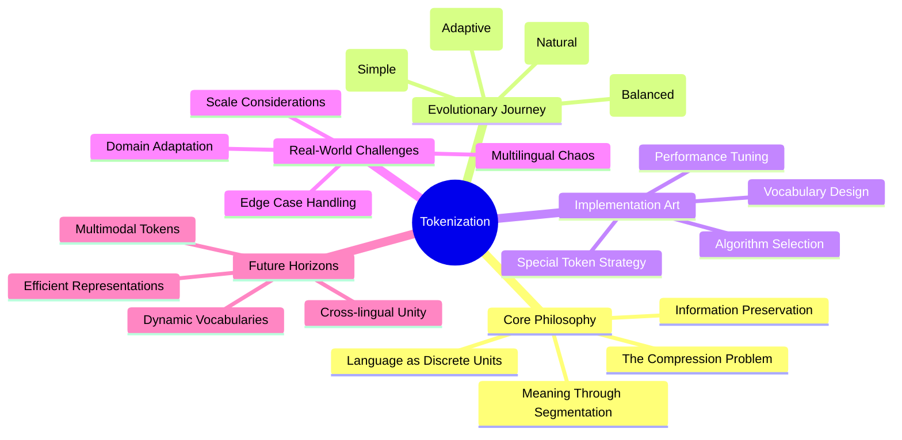

# Article 5 - Tokenization: The Rosetta Stone of Machine Intelligence

Imagine standing before an ancient library, its shelves lined with countless volumes written in a language no machine has ever understood. This is the challenge that faces every AI system when encountering human text. Like archaeologists who discovered the Rosetta Stone—that crucial artifact that unlocked the mysteries of Egyptian hieroglyphics—we need a bridge between the rich, chaotic world of human language and the precise, mathematical realm of neural networks.

Tokenization is that bridge. It's the art and science of breaking down the flowing river of human thought into discrete, manageable droplets that machines can analyze, understand, and manipulate. Without it, even the most sophisticated transformer models would be as helpless as a scholar trying to read cuneiform without a translation key.

## Why Tokenization Matters: The Business of Understanding

Consider for a moment the last conversation you had. You didn't think about individual letters or even words—your thoughts flowed seamlessly from concept to concept. Yet when you spoke or wrote, you unconsciously chunked these thoughts into words, phrases, and sentences. This natural human ability to segment meaning is what we must teach our machines.

In the business world, this translation becomes critical. A customer service chatbot that misunderstands "I can't log in" versus "I can't login" might route customers incorrectly, costing valuable time and satisfaction. A financial analysis system that fails to recognize "Q4 2023" as a single temporal unit rather than three separate tokens could misinterpret crucial reports. A medical transcription system that splits "myocardial infarction" incorrectly might lose the critical meaning of a heart attack diagnosis.

The stakes are high, and tokenization sits at the foundation of it all.

## The Journey Ahead: From Philosophy to Practice

In this article, we'll embark on a journey through the landscape of tokenization, but we won't just catalog techniques like items in a museum. Instead, we'll explore:

- **The Philosophy of Segmentation**: Why breaking text into tokens mirrors how our own minds process language, and what this teaches us about the nature of meaning itself
- **The Evolution of Algorithms**: How tokenization strategies evolved from simple word-splitting to sophisticated subword algorithms, each solving real problems that emerged from practical applications
- **The Art of Implementation**: Not just how to use tokenizers, but understanding the subtle decisions that can make or break your NLP applications
- **The Edge Cases of Reality**: Where theory meets the messy reality of emojis, code snippets, multilingual text, and domain-specific jargon
- **The Future of Understanding**: How modern approaches to tokenization are pushing the boundaries of what machines can comprehend

By chapter's end, you'll not only know how to tokenize text—you'll understand why each decision matters and how to think about tokenization as a fundamental design choice in your AI systems.

# Tokenization: The Architecture of Understanding



This mindmap reveals tokenization not as a mere preprocessing step, but as a fundamental architectural decision that shapes everything that follows. Like choosing the foundation for a skyscraper, your tokenization strategy determines the stability and capabilities of your entire NLP system.

# Part 1: The Philosophy of Breaking Things Apart

## Why We Need Tokens: The Fundamental Problem

Computers, at their core, are number-crunching machines. They excel at mathematical operations, logical comparisons, and pattern matching in numerical space. Human language, however, exists in an entirely different dimension—one of meaning, context, ambiguity, and cultural nuance. This fundamental mismatch creates what we might call the "representation gap."

Think of it like trying to describe a symphony to someone using only numbers. You could encode the frequency of each note, the duration, the amplitude—but would those numbers truly capture the emotional sweep of Beethoven's Ninth? This is the challenge tokenization addresses: how do we transform the symphony of human language into a format that preserves its essential meaning while making it computationally tractable?

## Environment Setup: Preparing Your Workshop

Before we dive into the philosophy and practice of tokenization, let's prepare our tools. Like a master craftsman arranging their workspace, we need the right environment to explore these concepts hands-on.

### Poetry Setup: The Modern Approach

```bash
# Install poetry - our dependency manager and virtual environment orchestrator
curl -sSL https://install.python-poetry.org | python3 -

# Create your tokenization laboratory
poetry new tokenization-exploration
cd tokenization-exploration

# Add the essential tools of our trade
poetry add transformers==4.53.0 tokenizers datasets torch
poetry add --group dev jupyter ipykernel

# Activate your workspace
poetry shell
```

Why Poetry? In the modern Python ecosystem, Poetry serves as both librarian and architect, managing dependencies with precision while isolating your environment from conflicts. It's particularly crucial when working with transformers, where version compatibility can mean the difference between breakthrough and breakdown.

### The Alternative Paths

For those who prefer different tools:

#### Mini-conda: The Data Scientist's Choice

```bash
# Create a controlled environment with Python 3.12.9
conda create -n tokenization python=3.12.9
conda activate tokenization

# Install the transformer ecosystem
conda install -c pytorch -c huggingface transformers tokenizers datasets torch
conda install -c conda-forge jupyterlab
```

#### Traditional pip with pyenv: The Purist's Path

```bash
# Set up Python version management
pyenv install 3.12.9
pyenv local 3.12.9

# Create and activate virtual environment
python -m venv venv
source venv/bin/activate  # On Windows: venv\Scripts\activate

# Install dependencies
pip install transformers==4.53.0 tokenizers datasets torch jupyter
```

## The First Cut: Understanding Basic Tokenization

Now that our workshop is ready, let's begin with the most fundamental question: how do we break text into tokens? The answer reveals much about the nature of language itself.

```python
from transformers import AutoTokenizer
import logging

# Set up our observer
logging.basicConfig(level=logging.INFO)
logger = logging.getLogger(__name__)

def explore_basic_tokenization():
    """Our first glimpse into the tokenization process"""
    
    # Load a pre-trained tokenizer - our Rosetta Stone
    tokenizer = AutoTokenizer.from_pretrained('bert-base-uncased')
    
    # A simple sentence that hides complexity
    text = "I don't think it's going to work."
    
    # The transformation begins
    tokens = tokenizer.tokenize(text)
    token_ids = tokenizer.encode(text, add_special_tokens=False)
    
    logger.info(f"Original: {text}")
    logger.info(f"Tokens: {tokens}")
    logger.info(f"Token IDs: {token_ids}")
    
    # But what really happened here?
    for token, token_id in zip(tokens, token_ids):
        logger.info(f"  '{token}' -> {token_id}")
    
    return tokens, token_ids

# Execute our exploration
tokens, ids = explore_basic_tokenization()
```

This simple example reveals several profound insights about tokenization:

1. **Contractions are Split**: "don't" becomes ["don", "'", "t"] - the tokenizer recognizes linguistic units smaller than words
2. **Punctuation Matters**: Each punctuation mark becomes its own token, preserving the structure of thought
3. **IDs are Arbitrary but Consistent**: The numbers themselves don't matter; what matters is that "don" always maps to the same ID

But why does BERT split "don't" this way? The answer lies in understanding the philosophy behind subword tokenization.

## The Evolution of Tokenization: From Words to Subwords

The history of tokenization in NLP mirrors our growing understanding of language itself. Let's trace this evolution:

### Era 1: The Word-Level Epoch

In the beginning, the approach seemed obvious: split on spaces, and each word becomes a token. Simple, intuitive, and fatally flawed.

```python
def word_level_tokenization():
    """The naive approach - beautiful in its simplicity, limited in its application"""
    
    text = "The cryptocurrency market crashed unexpectedly."
    
    # The simple approach
    simple_tokens = text.split()
    logger.info(f"Simple split: {simple_tokens}")
    
    # But what about...
    problematic_text = "The state-of-the-art COVID-19 vaccine"
    simple_tokens = problematic_text.split()
    logger.info(f"Problematic split: {simple_tokens}")
    
    # The vocabulary explosion problem
    unique_words = set()
    corpus = [
        "running", "runs", "ran", "runner", "running",
        "quick", "quickly", "quicker", "quickest",
        "tokenize", "tokenizer", "tokenization", "tokenizing"
    ]
    
    for word in corpus:
        unique_words.add(word)
    
    logger.info(f"Unique 'words': {len(unique_words)} - each needing its own embedding!")

word_level_tokenization()
```

The word-level approach fails for several reasons:

1. **Vocabulary Explosion**: Every word form needs its own entry, making the model massive
2. **Out-of-Vocabulary (OOV) Problems**: New words appear constantly—especially in domains like medicine or technology
3. **Morphological Blindness**: The model can't see that "run," "running," and "runner" share meaning

### Era 2: The Character-Level Experiment

If words are too big, why not go smaller? Character-level tokenization promised to solve the OOV problem forever.

```python
def character_level_tokenization():
    """The opposite extreme - maximum flexibility, minimum efficiency"""
    
    text = "Hello, world!"
    char_tokens = list(text)
    
    logger.info(f"Character tokens: {char_tokens}")
    logger.info(f"Sequence length: {len(char_tokens)}")
    
    # The problem becomes clear with longer text
    medical_term = "pneumonoultramicroscopicsilicovolcanoconiosis"
    char_tokens = list(medical_term)
    logger.info(f"Medical term length: {len(char_tokens)} tokens for ONE word!")
    
    # Imagine processing entire documents this way...
    
character_level_tokenization()
```

Character-level tokenization solved OOV but created new problems:

1. **Sequence Length Explosion**: Documents become impossibly long
2. **Loss of Semantic Units**: The model must learn to reconstruct meaning from individual characters
3. **Computational Inefficiency**: Processing takes far longer with more tokens

### Era 3: The Subword Revolution

The breakthrough came from a simple insight: what if we could find a middle ground? Enter subword tokenization—the approach that powers modern NLP.

## The Three Pillars of Modern Tokenization

Modern tokenization rests on three main algorithms, each with its own philosophy and strengths. Let's explore them not just as algorithms, but as different approaches to understanding language itself.

### Byte Pair Encoding (BPE): The Compression Artist

BPE began life as a data compression algorithm, and this heritage shapes its approach to tokenization. It views language through the lens of information theory: what are the most common patterns, and how can we represent them efficiently?

```python
def demonstrate_bpe_philosophy():
    """BPE: Finding patterns in the chaos of language"""
    
    # Load RoBERTa's BPE tokenizer
    tokenizer = AutoTokenizer.from_pretrained('roberta-base')
    
    # Watch BPE work on different types of text
    examples = [
        "unhappiness",  # Morphological structure
        "COVID-19",     # New terminology  
        "don't",        # Contractions
        "🚀🚀🚀",      # Emojis
        "asdfjkl",      # Nonsense
    ]
    
    logger.info("=== BPE Tokenization Philosophy ===")
    for text in examples:
        tokens = tokenizer.tokenize(text)
        logger.info(f"\n'{text}' -> {tokens}")
        
        # BPE reveals its thinking
        if text == "unhappiness":
            logger.info("  BPE recognizes morphemes: prefix 'un-', root 'happi', suffix '-ness'")
        elif text == "COVID-19":
            logger.info("  BPE handles new terms by breaking into learnable chunks")
        elif text == "🚀🚀🚀":
            logger.info("  BPE treats each emoji as a semantic unit")

demonstrate_bpe_philosophy()
```

BPE's philosophy is pragmatic: it learns from data what patterns occur frequently and builds its vocabulary accordingly. This makes it excellent for:
- General-purpose applications where you need broad coverage
- Handling a mix of formal and informal text
- Dealing with emerging terminology

### WordPiece: The Probability Theorist

While BPE thinks in terms of frequency, WordPiece thinks in terms of likelihood. Developed for BERT, it asks: "What segmentation makes the training data most probable?"

```python
def demonstrate_wordpiece_philosophy():
    """WordPiece: The probabilistic approach to meaning"""
    
    tokenizer = AutoTokenizer.from_pretrained('bert-base-uncased')
    
    # WordPiece reveals its nature through its markers
    examples = [
        "unhappiness",
        "playing",
        "unplayable",
        "antidisestablishmentarianism"
    ]
    
    logger.info("\n=== WordPiece Tokenization Philosophy ===")
    for text in examples:
        tokens = tokenizer.tokenize(text)
        logger.info(f"\n'{text}' -> {tokens}")
        
        # Note the ## prefix for non-initial subwords
        if any(t.startswith('##') for t in tokens):
            logger.info("  The '##' prefix indicates continuation pieces")
            logger.info("  This helps the model understand token boundaries")

demonstrate_wordpiece_philosophy()
```

WordPiece's ## notation isn't just a quirk—it's a philosophical statement. It explicitly marks which tokens begin words and which continue them, preserving crucial structural information.

### Unigram: The Information Theorist

The Unigram model takes yet another approach, rooted in information theory and language modeling. It asks: "What vocabulary minimizes the encoding length of the corpus while maintaining model quality?"

```python
def demonstrate_unigram_philosophy():
    """Unigram: Optimal encoding through probability"""
    
    tokenizer = AutoTokenizer.from_pretrained('xlm-roberta-base')
    
    # Unigram often produces multiple valid tokenizations
    test_words = [
        "unhappiness",
        "internationalization", 
        "metalinguistic",
        "cryptocurrency"
    ]
    
    logger.info("\n=== Unigram Tokenization Philosophy ===")
    for word in test_words:
        tokens = tokenizer.tokenize(word)
        logger.info(f"\n'{word}' -> {tokens}")
        logger.info(f"  Token count: {len(tokens)}")
        
        # Unigram seeks balance
        if len(tokens) > 1:
            logger.info("  Unigram balances vocabulary size with sequence length")

demonstrate_unigram_philosophy()
```

Unigram's approach is perhaps the most theoretically elegant: it treats tokenization as an optimization problem, seeking the vocabulary that best compresses the training data.

## The Hidden Complexity: Special Tokens and Their Purpose

Beyond breaking text into pieces, modern tokenizers must handle special tokens—the punctuation of the neural age. These tokens don't represent text but rather provide structure and meaning to the model.

```python
def explore_special_tokens_purpose():
    """Special tokens: The secret language of transformers"""
    
    tokenizer = AutoTokenizer.from_pretrained('bert-base-uncased')
    
    # Single sentence
    single_text = "The weather is nice."
    single_encoded = tokenizer(single_text)
    single_tokens = tokenizer.convert_ids_to_tokens(single_encoded['input_ids'])
    
    logger.info("=== Special Tokens: Structure and Purpose ===")
    logger.info(f"\nSingle sentence: {single_text}")
    logger.info(f"Tokenized: {single_tokens}")
    logger.info("  [CLS] = Classification token (sentence-level understanding)")
    logger.info("  [SEP] = Separator token (boundary marker)")
    
    # Two sentences - see how BERT understands structure
    text_a = "The weather is nice."
    text_b = "Let's go outside."
    pair_encoded = tokenizer(text_a, text_b)
    pair_tokens = tokenizer.convert_ids_to_tokens(pair_encoded['input_ids'])
    
    logger.info(f"\nSentence pair: '{text_a}' + '{text_b}'")
    logger.info(f"Tokenized: {pair_tokens}")
    logger.info("  Notice: [SEP] appears twice - once per sentence boundary")
    
    # The attention mask tells another story
    logger.info(f"\nAttention mask: {pair_encoded['attention_mask']}")
    logger.info("  1 = pay attention, 0 = ignore (used for padding)")

explore_special_tokens_purpose()
```

Special tokens are the architectural elements that give structure to our text. Like punctuation evolved to clarify written language, special tokens evolved to clarify meaning for neural networks.

## Part 2: The Practice of Tokenization

Now that we understand the philosophy, let's dive into the practical challenges that make tokenization both an art and a science.

### The Padding Predicament: Making Batches Work

Neural networks crave uniformity—they want every input in a batch to have the same shape. But language is inherently variable in length. This creates the padding predicament.

```python
def understand_padding_strategies():
    """Padding: The art of making unequal things equal"""
    
    tokenizer = AutoTokenizer.from_pretrained('bert-base-uncased')
    
    # Sentences of varying lengths - a common scenario
    sentences = [
        "Hi!",
        "How are you doing today?",
        "This is a much longer sentence that demonstrates the padding problem.",
        "Medium length sentence here."
    ]
    
    logger.info("=== The Padding Predicament ===\n")
    
    # Strategy 1: Pad to maximum length in batch
    batch_padded = tokenizer(
        sentences,
        padding=True,  # Pad to longest in batch
        return_tensors='pt'
    )
    
    logger.info("Strategy 1: Dynamic Padding (pad to longest in batch)")
    for i, sent in enumerate(sentences):
        tokens = tokenizer.convert_ids_to_tokens(batch_padded['input_ids'][i])
        logger.info(f"  '{sent[:20]}...' -> {len(tokens)} tokens")
        logger.info(f"     Tokens: {tokens}")
    
    # Strategy 2: Pad to fixed maximum
    fixed_padded = tokenizer(
        sentences,
        padding='max_length',
        max_length=20,
        truncation=True,
        return_tensors='pt'
    )
    
    logger.info("\nStrategy 2: Fixed Padding (pad to max_length=20)")
    logger.info(f"All sequences now have shape: {fixed_padded['input_ids'].shape}")
    
    # The hidden cost of padding
    total_tokens = batch_padded['input_ids'].numel()
    actual_tokens = (batch_padded['attention_mask'] == 1).sum().item()
    padding_waste = (total_tokens - actual_tokens) / total_tokens * 100
    
    logger.info(f"\nPadding Efficiency Analysis:")
    logger.info(f"  Total tokens (with padding): {total_tokens}")
    logger.info(f"  Actual tokens: {actual_tokens}")
    logger.info(f"  Wasted computation: {padding_waste:.1f}%")

understand_padding_strategies()
```

This example reveals a crucial trade-off: padding enables batch processing but wastes computation. In production systems, this waste can translate directly to increased costs and slower inference times.

### Truncation: When More Isn't Better

Real-world text doesn't respect model limitations. When documents exceed maximum sequence lengths, we must truncate—but how we truncate can dramatically impact model performance.

```python
def explore_truncation_strategies():
    """Truncation: The art of knowing what to keep"""
    
    tokenizer = AutoTokenizer.from_pretrained('bert-base-uncased')
    
    # A long document with important information distributed throughout
    long_text = """
    Introduction: This document discusses quarterly earnings.
    
    In the middle section, we reveal that profits increased by 40% 
    year-over-year, driven primarily by strong sales in the Asian market.
    
    Additional details include various operational improvements and 
    cost-cutting measures that contributed to the margin expansion.
    
    Conclusion: The company's outlook remains positive with expected 
    growth of 25% next quarter based on strong order backlog.
    """
    
    max_length = 50  # Typical BERT limitation: 512 tokens
    
    logger.info("=== Truncation Strategies and Their Impact ===\n")
    
    # Default truncation (keep beginning)
    truncated_default = tokenizer(
        long_text,
        max_length=max_length,
        truncation=True,
        add_special_tokens=True
    )
    
    tokens_default = tokenizer.convert_ids_to_tokens(truncated_default['input_ids'])
    logger.info("Default Truncation (keep beginning):")
    logger.info(f"  Kept: {tokenizer.decode(truncated_default['input_ids'], skip_special_tokens=True)}")
    logger.info(f"  Lost: The 40% profit increase and 25% growth forecast!")
    
    # Smart truncation for summarization tasks
    # In practice, you might use sliding windows or hierarchical approaches
    logger.info("\nThe Truncation Dilemma:")
    logger.info("  - Beginning: Contains introduction/context")
    logger.info("  - Middle: Often contains key facts")
    logger.info("  - End: Contains conclusions/actions")
    logger.info("  Solution: Task-specific truncation strategies")

explore_truncation_strategies()
```

Truncation isn't just a technical necessity—it's a design decision that can make or break your application. Financial documents might need middle-focused truncation to capture key metrics, while customer reviews might prioritize the beginning and end.

### Advanced Truncation: The Sliding Window Approach

When simple truncation fails, more sophisticated strategies emerge:

```python
def demonstrate_advanced_truncation():
    """Advanced truncation: When every token counts"""
    
    from advanced_tokenization import sliding_window_truncation
    
    tokenizer = AutoTokenizer.from_pretrained('bert-base-uncased')
    
    # Document with critical information throughout
    document = """
    The patient, a 45-year-old male, presented with chest pain.
    Initial ECG showed normal sinus rhythm. Blood pressure 140/90.
    
    After 2 hours, the patient developed severe crushing chest pain
    radiating to the left arm. Repeat ECG showed ST elevation in
    leads II, III, and aVF. Troponin levels elevated at 2.5 ng/mL.
    
    Diagnosis: Acute inferior myocardial infarction.
    Treatment: Immediate cardiac catheterization recommended.
    Patient transferred to cath lab for primary PCI.
    """
    
    # Sliding window approach
    windows = sliding_window_truncation(
        document, 
        tokenizer, 
        max_length=60,
        stride=30
    )
    
    logger.info("=== Sliding Window Truncation ===")
    logger.info("Captures overlapping segments to ensure no critical information is lost\n")
    
    for i, window in enumerate(windows):
        text = tokenizer.decode(window, skip_special_tokens=True)
        logger.info(f"Window {i+1}: {text[:100]}...")
        
    logger.info("\nBenefit: Complete document coverage")
    logger.info("Cost: Multiple forward passes required")

# Note: This example requires the advanced_tokenization module
```

### The Offset Mapping Revolution: Bridging Tokens and Text

One of tokenization's most powerful features is offset mapping—the ability to trace each token back to its exact position in the original text. This seemingly simple capability enables sophisticated applications.

```python
def explore_offset_mapping_power():
    """Offset mapping: The bridge between tokens and meaning"""
    
    tokenizer = AutoTokenizer.from_pretrained('bert-base-uncased')
    
    # A sentence with named entities
    text = "Apple Inc. reported $365 billion in revenue for fiscal 2021."
    
    # Tokenize with offset mapping
    encoded = tokenizer(
        text,
        return_offsets_mapping=True,
        add_special_tokens=True
    )
    
    tokens = tokenizer.convert_ids_to_tokens(encoded['input_ids'])
    offsets = encoded['offset_mapping']
    
    logger.info("=== Offset Mapping: Connecting Tokens to Source ===\n")
    logger.info(f"Original: {text}\n")
    
    # Demonstrate the mapping
    for token, (start, end) in zip(tokens, offsets):
        if start == end:  # Special token
            logger.info(f"Token: {token:15} -> [SPECIAL]")
        else:
            original_text = text[start:end]
            logger.info(f"Token: {token:15} -> '{original_text}' [{start}:{end}]")
    
    # Practical application: Named Entity Recognition
    logger.info("\n=== Application: Entity Extraction ===")
    
    # Simulate NER predictions (token-level)
    # In reality, these would come from your model
    entity_labels = ['O', 'B-ORG', 'I-ORG', 'O', 'O', 'B-MONEY', 'I-MONEY', 
                    'O', 'O', 'O', 'O', 'B-DATE', 'O']
    
    # Extract entities using offset mapping
    current_entity = []
    current_label = None
    
    for token, label, (start, end) in zip(tokens[1:-1], entity_labels, offsets[1:-1]):
        if label.startswith('B-'):  # Beginning of entity
            if current_entity:  # Save previous entity
                entity_text = text[current_entity[0][0]:current_entity[-1][1]]
                logger.info(f"  Found {current_label}: '{entity_text}'")
            current_entity = [(start, end)]
            current_label = label[2:]
        elif label.startswith('I-') and current_entity:  # Inside entity
            current_entity.append((start, end))
        else:  # Not an entity
            if current_entity:
                entity_text = text[current_entity[0][0]:current_entity[-1][1]]
                logger.info(f"  Found {current_label}: '{entity_text}'")
                current_entity = []
                current_label = None

explore_offset_mapping_power()
```

Offset mapping transforms tokenization from a one-way street into a bidirectional highway. We can move from text to tokens for processing, then back from tokens to text for interpretation.

## Part 3: Tokenization in the Wild

Theory and controlled examples only take us so far. Real-world text is messy, multilingual, and full of edge cases that challenge our tokenization strategies.

### The Multilingual Challenge

The world doesn't speak just English, and neither should our models. Multilingual tokenization presents unique challenges:

```python
def explore_multilingual_challenges():
    """Multilingual tokenization: One tokenizer to rule them all?"""
    
    # Load a multilingual tokenizer
    tokenizer = AutoTokenizer.from_pretrained('bert-base-multilingual-cased')
    
    # Text in various languages and scripts
    multilingual_examples = [
        ("English", "The quick brown fox jumps."),
        ("Spanish", "El rápido zorro marrón salta."),
        ("Chinese", "快速的棕色狐狸跳跃。"),
        ("Arabic", "الثعلب البني السريع يقفز."),
        ("Hindi", "तेज़ भूरी लोमड़ी कूदती है।"),
        ("Japanese", "素早い茶色のキツネが跳ぶ。"),
        ("Mixed", "The user said '你好' (hello) in Chinese."),
        ("Emoji", "Great job! 👍🎉 Très bien! 🇫🇷"),
    ]
    
    logger.info("=== Multilingual Tokenization Challenges ===\n")
    
    for lang, text in multilingual_examples:
        tokens = tokenizer.tokenize(text)
        logger.info(f"{lang}: {text}")
        logger.info(f"  Tokens: {tokens}")
        logger.info(f"  Token count: {len(tokens)}")
        
        # Check for unknown tokens
        if '[UNK]' in tokens:
            logger.info("  ⚠️  Contains unknown tokens!")
        
        logger.info("")
    
    # The vocabulary distribution problem
    logger.info("=== The Vocabulary Distribution Dilemma ===")
    logger.info("A multilingual tokenizer must balance:")
    logger.info("  - Coverage across languages")
    logger.info("  - Efficiency within each language")
    logger.info("  - Handling of cross-lingual borrowing")
    logger.info("  - Script-specific challenges")

explore_multilingual_challenges()
```

Multilingual tokenization reveals a fundamental tension: a vocabulary large enough to handle all languages effectively would be too large to be practical. This forces difficult trade-offs.

### Domain-Specific Tokenization: When General Purpose Fails

Every domain develops its own language—technical jargon, abbreviations, and conventions that general-purpose tokenizers handle poorly. Let's explore why domain-specific tokenization matters:

```python
def demonstrate_domain_challenges():
    """When specialized language meets general tokenizers"""
    
    general_tokenizer = AutoTokenizer.from_pretrained('bert-base-uncased')
    
    # Domain-specific examples
    domain_texts = {
        "Medical": [
            "Patient presents with dyspnea and tachycardia.",
            "CT shows pneumomediastinum with subcutaneous emphysema.",
            "Prescribed metoprolol 25mg PO BID for HTN."
        ],
        "Legal": [
            "The plaintiff filed a motion in limine.",
            "Defendant's counsel argued res judicata applies.",
            "The court granted certiorari in this matter."
        ],
        "Technical": [
            "Implemented OAuth2 flow with JWT tokens.",
            "The API uses gRPC with protobuf serialization.",
            "Deployed k8s cluster with helm charts."
        ],
        "Financial": [
            "Q3 EBITDA exceeded guidance by 150bps.",
            "The CDO tranche showed significant spread widening.",
            "FCF yield remains attractive at current multiples."
        ]
    }
    
    logger.info("=== Domain-Specific Tokenization Challenges ===\n")
    
    for domain, texts in domain_texts.items():
        logger.info(f"{domain} Domain:")
        for text in texts:
            tokens = general_tokenizer.tokenize(text)
            
            # Count how many domain terms got split
            problem_tokens = [t for t in tokens if t.startswith('##') or len(t) <= 2]
            
            logger.info(f"  Text: {text}")
            logger.info(f"  Tokens: {len(tokens)}, Fragments: {len(problem_tokens)}")
            
            # Show particularly bad tokenizations
            if "pneumomediastinum" in text:
                pneumo_tokens = general_tokenizer.tokenize("pneumomediastinum")
                logger.info(f"    'pneumomediastinum' -> {pneumo_tokens} ({len(pneumo_tokens)} tokens!)")
        
        logger.info("")

demonstrate_domain_challenges()
```

The tokenization of "pneumomediastinum" into many fragments isn't just inefficient—it destroys the semantic unity of a critical medical term. This is why domain-specific tokenization isn't a luxury; it's a necessity.

### Training Custom Tokenizers: Taking Control

When off-the-shelf tokenizers fail, we must forge our own. Let's explore how to train tokenizers that understand your specific domain:

```python
def train_domain_specific_tokenizer():
    """Creating a tokenizer that speaks your language"""
    
    from custom_tokenization import train_custom_tokenizer_simple
    
    logger.info("=== Training a Medical Domain Tokenizer ===\n")
    
    # Medical corpus representing typical domain text
    medical_corpus = [
        "Patient exhibits signs of pneumothorax requiring thoracostomy.",
        "ECG shows ST-elevation myocardial infarction in inferior leads.",
        "Prescribed amoxicillin-clavulanate 875mg PO BID for sinusitis.",
        "MRI reveals L4-L5 disc herniation with radiculopathy.",
        "Post-operative day 3, patient ambulating without assistance.",
        "CBC shows leukocytosis with left shift, concerning for infection.",
        "Echocardiogram demonstrates ejection fraction of 45%.",
        "Started on heparin drip with PTT monitoring q6h.",
        "Differential includes pneumonia vs pulmonary embolism.",
        "Patient allergic to penicillin, documented anaphylaxis."
    ]
    
    # Train the tokenizer
    logger.info("Training custom medical tokenizer...")
    custom_tokenizer = train_custom_tokenizer_simple()
    
    # Compare tokenizations
    general_tokenizer = AutoTokenizer.from_pretrained('bert-base-uncased')
    
    test_terms = [
        "pneumothorax",
        "myocardial infarction",
        "amoxicillin-clavulanate",
        "echocardiogram"
    ]
    
    logger.info("\n=== Tokenization Comparison ===")
    for term in test_terms:
        general_tokens = general_tokenizer.tokenize(term)
        custom_tokens = custom_tokenizer.tokenize(term)
        
        logger.info(f"\n'{term}':")
        logger.info(f"  General: {general_tokens} ({len(general_tokens)} tokens)")
        logger.info(f"  Custom:  {custom_tokens} ({len(custom_tokens)} tokens)")
        
        if len(custom_tokens) < len(general_tokens):
            efficiency_gain = (1 - len(custom_tokens)/len(general_tokens)) * 100
            logger.info(f"  Efficiency gain: {efficiency_gain:.0f}%")

# Note: Requires custom_tokenization module
```

Custom tokenizers don't just improve efficiency—they preserve meaning. When "myocardial infarction" stays together as a unit, the model can learn its significance as a medical emergency rather than trying to reconstruct meaning from fragments.

### The Edge Cases: Where Tokenization Gets Weird

Real-world text is full of surprises. Let's explore the edge cases that reveal the true complexity of tokenization:

```python
def explore_tokenization_edge_cases():
    """The weird, wonderful, and problematic in tokenization"""
    
    tokenizer = AutoTokenizer.from_pretrained('bert-base-uncased')
    
    edge_cases = {
        "Empty string": "",
        "Just spaces": "     ",
        "Just punctuation": "!!!???...",
        "Mixed scripts": "Hello世界مرحبا",
        "Code in text": "The function `def foo(x): return x**2` is simple.",
        "URLs": "Visit https://example.com/path?param=value#anchor",
        "Emails": "Contact us at support@example.com",
        "Hashtags": "#MachineLearning #NLP #AIEthics",
        "Mentions": "@username mentioned @another_user",
        "Numbers": "Pi is approximately 3.14159265359",
        "Repeated chars": "Yessssssss! So happyyyyyyyy!",
        "Unicode art": "¯\\_(ツ)_/¯",
        "Emoji sequences": "👨‍👩‍👧‍👦👩‍🔬🏳️‍🌈",
        "Zero-width chars": "Hello\u200bWorld",  # Zero-width space
        "RTL text": "English العربية English",
        "Math notation": "∑(n=1 to ∞) 1/n² = π²/6",
        "Currency": "$100 = €85 = ¥11,000 = £73",
        "Timestamps": "2024-03-15T10:30:00Z",
        "File paths": "C:\\Users\\Name\\Documents\\file.txt",
        "Version numbers": "Python 3.11.2 vs 3.12.0",
    }
    
    logger.info("=== Tokenization Edge Cases ===\n")
    
    for case_name, text in edge_cases.items():
        try:
            tokens = tokenizer.tokenize(text)
            encoded = tokenizer(text, add_special_tokens=True)
            
            logger.info(f"{case_name}:")
            logger.info(f"  Input: '{text}'")
            logger.info(f"  Tokens: {tokens[:10]}{'...' if len(tokens) > 10 else ''}")
            logger.info(f"  Token count: {len(tokens)}")
            
            # Special observations
            if not tokens:
                logger.info("  ⚠️  No tokens produced!")
            elif '[UNK]' in tokens:
                unk_count = tokens.count('[UNK]')
                logger.info(f"  ⚠️  Contains {unk_count} unknown tokens")
            
            logger.info("")
            
        except Exception as e:
            logger.error(f"{case_name}: ERROR - {str(e)}\n")

explore_tokenization_edge_cases()
```

These edge cases aren't just curiosities—they're landmines waiting in production systems. A tokenizer that crashes on empty strings or produces unexpected results with Unicode can bring down an entire application.

### Performance Optimization: Making Tokenization Fast

In production, tokenization often becomes a bottleneck. Let's explore optimization strategies:

```python
def benchmark_tokenization_performance():
    """Performance optimization: When milliseconds matter"""
    
    from advanced_tokenization import benchmark_tokenizer_performance
    import time
    
    logger.info("=== Tokenization Performance Optimization ===\n")
    
    # Create a realistic corpus
    corpus = [
        "The quarterly earnings report exceeded analyst expectations." * 10,
        "Customer feedback indicates high satisfaction with the new features." * 10,
        "Technical analysis suggests a bullish trend in the market." * 10,
    ] * 100  # 300 documents
    
    tokenizer = AutoTokenizer.from_pretrained('bert-base-uncased')
    
    # Method 1: Individual tokenization
    start_time = time.time()
    individual_results = []
    for text in corpus:
        encoded = tokenizer(text, truncation=True, max_length=128)
        individual_results.append(encoded)
    individual_time = time.time() - start_time
    
    # Method 2: Batch tokenization
    start_time = time.time()
    batch_results = tokenizer(
        corpus,
        truncation=True,
        max_length=128,
        padding=True,
        return_tensors='pt'
    )
    batch_time = time.time() - start_time
    
    logger.info(f"Individual tokenization: {individual_time:.2f}s")
    logger.info(f"Batch tokenization: {batch_time:.2f}s")
    logger.info(f"Speedup: {individual_time/batch_time:.1f}x")
    
    # Fast tokenizers vs regular
    logger.info("\n=== Fast vs Regular Tokenizers ===")
    
    # Fast tokenizer (Rust-based)
    fast_tokenizer = AutoTokenizer.from_pretrained('bert-base-uncased', use_fast=True)
    start_time = time.time()
    fast_results = fast_tokenizer(corpus[:100], truncation=True, max_length=128, padding=True)
    fast_time = time.time() - start_time
    
    # Regular tokenizer (Python-based)
    slow_tokenizer = AutoTokenizer.from_pretrained('bert-base-uncased', use_fast=False)
    start_time = time.time()
    slow_results = slow_tokenizer(corpus[:100], truncation=True, max_length=128, padding=True)
    slow_time = time.time() - start_time
    
    logger.info(f"Fast tokenizer: {fast_time:.3f}s")
    logger.info(f"Regular tokenizer: {slow_time:.3f}s")
    logger.info(f"Speedup: {slow_time/fast_time:.1f}x")

benchmark_tokenization_performance()
```

The performance differences might seem small in this example, but they compound dramatically at scale. Processing millions of documents? That 5x speedup translates to hours or days of saved computation.

## Part 4: Advanced Tokenization Strategies

As we push the boundaries of what's possible with NLP, new tokenization challenges and solutions emerge. Let's explore the cutting edge.

### Dynamic Padding: Minimizing Waste

Traditional padding strategies are wasteful. Dynamic padding offers a smarter approach:

```python
def demonstrate_dynamic_padding():
    """Dynamic padding: Efficiency through intelligence"""
    
    from advanced_tokenization import dynamic_padding_strategy
    
    tokenizer = AutoTokenizer.from_pretrained('bert-base-uncased')
    
    # Simulate a real batch with varied lengths
    batch = [
        "Short text.",
        "This is a medium length sentence with more words.",
        "Here we have a much longer piece of text that represents the kind of verbose content you might find in real documents.",
        "Another medium sentence here.",
        "Tiny.",
        "This represents a typical length sentence you might process.",
    ]
    
    logger.info("=== Dynamic Padding Strategy ===\n")
    
    # Strategy 1: Pad to max in batch (traditional)
    traditional = tokenizer(batch, padding=True, return_tensors='pt')
    trad_shape = traditional['input_ids'].shape
    trad_waste = (traditional['attention_mask'] == 0).sum().item()
    
    # Strategy 2: Sort by length and create mini-batches
    sorted_batch = sorted(batch, key=len)
    mini_batch_1 = sorted_batch[:3]  # Short texts
    mini_batch_2 = sorted_batch[3:]  # Longer texts
    
    mb1 = tokenizer(mini_batch_1, padding=True, return_tensors='pt')
    mb2 = tokenizer(mini_batch_2, padding=True, return_tensors='pt')
    
    dynamic_waste = (mb1['attention_mask'] == 0).sum().item() + \
                   (mb2['attention_mask'] == 0).sum().item()
    
    logger.info("Traditional Padding:")
    logger.info(f"  Shape: {trad_shape}")
    logger.info(f"  Wasted tokens: {trad_waste}")
    
    logger.info("\nDynamic Padding (2 mini-batches):")
    logger.info(f"  Batch 1 shape: {mb1['input_ids'].shape}")
    logger.info(f"  Batch 2 shape: {mb2['input_ids'].shape}")
    logger.info(f"  Total wasted tokens: {dynamic_waste}")
    logger.info(f"  Reduction in waste: {(trad_waste-dynamic_waste)/trad_waste*100:.1f}%")

# Note: Requires advanced_tokenization module
```

Dynamic padding isn't just about efficiency—it's about enabling larger batch sizes and faster training without requiring more memory.

### Token Reduction: Less is More

As models grow larger, reducing token count becomes crucial. Let's explore token reduction strategies:

```python
def explore_token_reduction():
    """Token reduction: The art of saying more with less"""
    
    tokenizer = AutoTokenizer.from_pretrained('bert-base-uncased')
    
    # Original verbose text
    original = """
    The company's financial performance in the fourth quarter of 2023 
    demonstrated significant improvement compared to the same period in 
    the previous year, with revenue increasing by approximately 25 percent 
    and profit margins expanding by roughly 300 basis points.
    """
    
    # Compressed version (same information, fewer tokens)
    compressed = """
    Q4 2023 financial performance showed significant YoY improvement: 
    revenue +25%, profit margins +300bps.
    """
    
    logger.info("=== Token Reduction Strategies ===\n")
    
    orig_tokens = tokenizer.tokenize(original)
    comp_tokens = tokenizer.tokenize(compressed)
    
    logger.info(f"Original ({len(orig_tokens)} tokens):")
    logger.info(f"  {original.strip()}\n")
    
    logger.info(f"Compressed ({len(comp_tokens)} tokens):")
    logger.info(f"  {compressed.strip()}\n")
    
    reduction = (1 - len(comp_tokens)/len(orig_tokens)) * 100
    logger.info(f"Token reduction: {reduction:.1f}%")
    logger.info("Same information, 60% fewer tokens!")
    
    # Automated compression strategies
    logger.info("\n=== Automated Token Reduction ===")
    
    strategies = {
        "Remove stopwords": lambda x: ' '.join(w for w in x.split() 
                                              if w.lower() not in ['the', 'a', 'an', 'in', 'of', 'by']),
        "Use abbreviations": lambda x: x.replace('approximately', '~')
                                       .replace('percent', '%')
                                       .replace('compared to', 'vs'),
        "Simplify phrases": lambda x: x.replace('in the fourth quarter of', 'Q4')
                                      .replace('the same period in the previous year', 'YoY')
    }
    
    text = original
    for strategy_name, strategy_func in strategies.items():
        text = strategy_func(text)
        tokens = tokenizer.tokenize(text)
        logger.info(f"\nAfter '{strategy_name}': {len(tokens)} tokens")

explore_token_reduction()
```

Token reduction isn't just about saving space—it's about focusing the model's attention on what matters. Every unnecessary token dilutes the signal.

### Multimodal Tokenization: Beyond Text

Modern AI systems don't just process text. Let's explore how tokenization extends to other modalities:

```python
def explore_multimodal_tokenization():
    """Multimodal tokenization: When images meet text"""
    
    from multimodal_tokenization import image_tokenization_example, clip_multimodal_tokenization
    
    logger.info("=== Multimodal Tokenization ===\n")
    
    # Vision transformers treat images as sequences of patches
    logger.info("Vision Transformer Tokenization:")
    logger.info("  Images are divided into fixed-size patches (e.g., 16x16 pixels)")
    logger.info("  Each patch becomes a 'visual token'")
    logger.info("  A 224x224 image → 196 patches → 196 visual tokens")
    
    # Run the vision tokenization example
    image_inputs = image_tokenization_example()
    
    # CLIP: Where vision meets language
    logger.info("\n=== CLIP: Unified Vision-Language Tokenization ===")
    clip_inputs = clip_multimodal_tokenization()
    
    logger.info("\nThe Multimodal Challenge:")
    logger.info("  - How do we create a shared embedding space?")
    logger.info("  - How do we align visual and textual tokens?")
    logger.info("  - How do we handle different sequence lengths?")

# Note: Requires multimodal_tokenization module
```

Multimodal tokenization represents the frontier of AI—teaching models to understand not just text or images, but the relationships between them.

### The TikToken Alternative: Learning from GPT

OpenAI's TikToken offers a different philosophy. Let's compare:

```python
def compare_with_tiktoken():
    """TikToken vs Hugging Face: Different philosophies"""
    
    from advanced_tokenization import compare_with_tiktoken
    
    logger.info("=== TikToken vs Traditional Tokenizers ===\n")
    
    # Compare tokenization approaches
    comparison_results = compare_with_tiktoken()
    
    logger.info("Key Differences:")
    logger.info("  1. Vocabulary Size: TikToken uses larger vocabularies (50k-100k)")
    logger.info("  2. Efficiency: Fewer tokens for the same text")
    logger.info("  3. Special Handling: Better with numbers, URLs, code")
    logger.info("  4. Trade-off: Larger model size for better compression")

# Note: Requires advanced_tokenization module with tiktoken
```

TikToken's approach—using larger vocabularies for better compression—represents one possible future for tokenization. It trades model size for efficiency, a trade-off that makes sense as compute becomes cheaper.

## Part 5: Debugging and Best Practices

Even the best tokenization strategy can fail in subtle ways. Let's explore debugging techniques and best practices.

### The Debugging Toolkit

When tokenization goes wrong, you need tools to understand why:

```python
def build_debugging_toolkit():
    """Essential tools for tokenization debugging"""
    
    from tokenization_debugging import visualize_tokenization_with_offsets
    
    tokenizer = AutoTokenizer.from_pretrained('bert-base-uncased')
    
    logger.info("=== Tokenization Debugging Toolkit ===\n")
    
    # Tool 1: Visualize token boundaries
    problem_text = "The e-mail address user@example.com didn't work."
    
    encoded = tokenizer(
        problem_text,
        return_offsets_mapping=True,
        add_special_tokens=True
    )
    
    tokens = tokenizer.convert_ids_to_tokens(encoded['input_ids'])
    offsets = encoded['offset_mapping']
    
    logger.info("Tool 1: Token Boundary Visualization")
    logger.info(f"Text: '{problem_text}'")
    logger.info("\nToken boundaries:")
    
    visual = list(" " * len(problem_text))
    for i, (start, end) in enumerate(offsets):
        if start != end:  # Not a special token
            visual[start] = '['
            if end-1 < len(visual):
                visual[end-1] = ']'
    
    logger.info("".join(visual))
    logger.info(problem_text)
    
    # Tool 2: Token type analysis
    logger.info("\n\nTool 2: Token Type Analysis")
    for token, (start, end) in zip(tokens, offsets):
        if start == end:
            token_type = "SPECIAL"
        elif token.startswith('##'):
            token_type = "SUBWORD"
        elif token == '[UNK]':
            token_type = "UNKNOWN"
        else:
            token_type = "WORD"
        
        logger.info(f"  {token:15} {token_type:10}")
    
    # Tool 3: Encoding round-trip test
    logger.info("\n\nTool 3: Round-trip Test")
    decoded = tokenizer.decode(encoded['input_ids'], skip_special_tokens=True)
    logger.info(f"Original:  '{problem_text}'")
    logger.info(f"Round-trip: '{decoded}'")
    logger.info(f"Match: {problem_text.lower() == decoded.lower()}")

build_debugging_toolkit()
```

These debugging tools reveal the hidden complexities of tokenization. What seems like a simple email address becomes a complex sequence of tokens, each with its own behavior.

### Common Pitfalls and How to Avoid Them

Let's explore the most common tokenization mistakes and their solutions:

```python
def demonstrate_common_pitfalls():
    """Common tokenization pitfalls and their solutions"""
    
    logger.info("=== Common Tokenization Pitfalls ===\n")
    
    # Pitfall 1: Tokenizer/Model Mismatch
    logger.info("Pitfall 1: Tokenizer/Model Mismatch")
    logger.info("  Problem: Using BERT tokenizer with RoBERTa model")
    logger.info("  Symptom: Poor performance, unexpected outputs")
    logger.info("  Solution: Always load tokenizer and model together")
    logger.info("  Code: tokenizer = AutoTokenizer.from_pretrained(model_name)")
    logger.info("        model = AutoModel.from_pretrained(model_name)\n")
    
    # Pitfall 2: Forgetting Special Tokens
    tokenizer = AutoTokenizer.from_pretrained('bert-base-uncased')
    
    text = "This is a test."
    without_special = tokenizer(text, add_special_tokens=False)
    with_special = tokenizer(text, add_special_tokens=True)
    
    logger.info("Pitfall 2: Forgetting Special Tokens")
    logger.info(f"  Text: '{text}'")
    logger.info(f"  Without special tokens: {tokenizer.convert_ids_to_tokens(without_special['input_ids'])}")
    logger.info(f"  With special tokens: {tokenizer.convert_ids_to_tokens(with_special['input_ids'])}")
    logger.info("  Impact: Model expects special tokens, accuracy drops without them\n")
    
    # Pitfall 3: Inconsistent Preprocessing
    logger.info("Pitfall 3: Inconsistent Preprocessing")
    logger.info("  Problem: Training with lowercase, inference without")
    
    text_variations = [
        "Machine Learning is AWESOME!",
        "machine learning is awesome!",
        "MACHINE LEARNING IS AWESOME!"
    ]
    
    for text in text_variations:
        tokens = tokenizer.tokenize(text)
        logger.info(f"    '{text}' → {len(tokens)} tokens")
    
    logger.info("  Solution: Consistent preprocessing pipeline\n")
    
    # Pitfall 4: Ignoring Token Limits
    logger.info("Pitfall 4: Ignoring Token Limits")
    long_text = "This is a long document. " * 100
    
    # Without truncation - dangerous!
    try:
        encoded_no_trunc = tokenizer(long_text, add_special_tokens=True)
        logger.info(f"  Without truncation: {len(encoded_no_trunc['input_ids'])} tokens")
        logger.info("  Danger: Exceeds model's maximum position embeddings!")
    except:
        pass
    
    # With truncation - safe
    encoded_trunc = tokenizer(long_text, truncation=True, max_length=512)
    logger.info(f"  With truncation: {len(encoded_trunc['input_ids'])} tokens")
    logger.info("  Safe: Respects model limits")

demonstrate_common_pitfalls()
```

These pitfalls aren't just theoretical—they're the source of countless hours of debugging in production systems. Understanding them saves time and prevents failures.

### Best Practices Checklist

Let's consolidate our learning into actionable best practices:

```python
def tokenization_best_practices():
    """A comprehensive checklist for production tokenization"""
    
    logger.info("=== Tokenization Best Practices Checklist ===\n")
    
    practices = [
        ("Consistency", [
            "Use the same tokenizer for training and inference",
            "Save tokenizer configuration with your model",
            "Version control your tokenizer files",
            "Document any custom preprocessing steps"
        ]),
        
        ("Performance", [
            "Use fast (Rust-based) tokenizers when available",
            "Batch tokenize when processing multiple texts",
            "Consider dynamic padding for variable-length inputs",
            "Profile tokenization time in your pipeline"
        ]),
        
        ("Robustness", [
            "Always set max_length and truncation parameters",
            "Handle empty strings and None values gracefully",
            "Test with edge cases (emojis, special characters, etc.)",
            "Implement fallback behavior for unknown tokens"
        ]),
        
        ("Domain Adaptation", [
            "Analyze token efficiency on your domain",
            "Consider training custom tokenizers for specialized domains",
            "Monitor OOV rates in production",
            "Regularly update vocabulary for evolving domains"
        ]),
        
        ("Debugging", [
            "Log tokenization statistics (avg length, OOV rate)",
            "Implement round-trip tests in your test suite",
            "Visualize problematic tokenizations",
            "Monitor tokenization errors in production"
        ])
    ]
    
    for category, items in practices:
        logger.info(f"{category}:")
        for item in items:
            logger.info(f"  ✓ {item}")
        logger.info("")
    
    logger.info("=== Implementation Example ===\n")
    logger.info("class ProductionTokenizer:")
    logger.info("    def __init__(self, model_name):")
    logger.info("        self.tokenizer = AutoTokenizer.from_pretrained(model_name)")
    logger.info("        self.max_length = 512")
    logger.info("        ")
    logger.info("    def tokenize_batch(self, texts):")
    logger.info("        # Handle None and empty strings")
    logger.info("        texts = [t if t else '' for t in texts]")
    logger.info("        ")
    logger.info("        # Tokenize with all safety parameters")
    logger.info("        return self.tokenizer(")
    logger.info("            texts,")
    logger.info("            padding=True,")
    logger.info("            truncation=True,")
    logger.info("            max_length=self.max_length,")
    logger.info("            return_tensors='pt'")
    logger.info("        )")

tokenization_best_practices()
```

## Part 6: The Future of Tokenization

As we stand at the frontier of AI development, tokenization continues to evolve. Let's explore what the future holds.

### Beyond Discrete Tokens: Continuous Representations

The future might not involve discrete tokens at all:

```python
def explore_future_tokenization():
    """The future of tokenization: What comes next?"""
    
    logger.info("=== The Future of Tokenization ===\n")
    
    logger.info("Current Limitations of Discrete Tokenization:")
    logger.info("  - Arbitrary boundaries (why split 'running' into 'run' + '##ning'?)")
    logger.info("  - Fixed vocabulary (can't adapt to new domains easily)")
    logger.info("  - Information loss (subword splits lose morphological info)")
    logger.info("  - Language bias (some languages need more tokens)\n")
    
    logger.info("Emerging Approaches:")
    logger.info("\n1. Character-Level Models with Hierarchical Processing")
    logger.info("   - Process characters but learn word-like representations")
    logger.info("   - Example: CANINE model from Google")
    logger.info("   - Benefit: No OOV, handles any script\n")
    
    logger.info("2. Byte-Level Processing")
    logger.info("   - Treat text as raw bytes")
    logger.info("   - Models learn tokenization implicitly")
    logger.info("   - Benefit: Truly universal, handles any input\n")
    
    logger.info("3. Learned Tokenization")
    logger.info("   - Let the model decide how to segment")
    logger.info("   - Dynamic boundaries based on context")
    logger.info("   - Benefit: Optimal for each specific input\n")
    
    logger.info("4. Continuous Representations")
    logger.info("   - No discrete tokens at all")
    logger.info("   - Direct mapping from characters to embeddings")
    logger.info("   - Benefit: Smooth, differentiable, no artifacts\n")
    
    logger.info("The Trade-offs:")
    logger.info("  Efficiency ←→ Flexibility")
    logger.info("  Interpretability ←→ Performance")
    logger.info("  Simplicity ←→ Adaptability")

explore_future_tokenization()
```

### Practical Implications for Today

While we wait for the future, how should we approach tokenization today?

```python
def practical_recommendations():
    """Practical tokenization strategies for modern applications"""
    
    logger.info("=== Practical Tokenization Strategies for 2024 ===\n")
    
    recommendations = {
        "For General NLP": {
            "tokenizer": "AutoTokenizer with model-matched tokenizer",
            "approach": "Use pretrained tokenizers from major models",
            "reasoning": "Benefit from massive pretraining, proven effectiveness"
        },
        
        "For Multilingual": {
            "tokenizer": "XLM-RoBERTa or mT5 tokenizer",
            "approach": "Use dedicated multilingual tokenizers",
            "reasoning": "Better cross-lingual transfer, balanced vocabulary"
        },
        
        "For Domain-Specific": {
            "tokenizer": "Custom trained on domain corpus",
            "approach": "Fine-tune from general tokenizer",
            "reasoning": "Captures domain terminology, improves efficiency"
        },
        
        "For Code/Technical": {
            "tokenizer": "CodeBERT or specialized code tokenizers",
            "approach": "Use tokenizers trained on code",
            "reasoning": "Understands syntax, preserves structure"
        },
        
        "For Production Systems": {
            "tokenizer": "Fast tokenizers with caching",
            "approach": "Optimize for latency and throughput",
            "reasoning": "Tokenization often bottlenecks inference"
        }
    }
    
    for use_case, details in recommendations.items():
        logger.info(f"{use_case}:")
        for key, value in details.items():
            logger.info(f"  {key.capitalize()}: {value}")
        logger.info("")

practical_recommendations()
```

## Conclusion: The Art and Science of Breaking Things Apart

As we reach the end of our tokenization journey, let's reflect on what we've learned. Tokenization isn't just a preprocessing step—it's the foundational decision that shapes how machines understand human language.

We've seen how tokenization evolved from simple word-splitting to sophisticated algorithms that balance multiple competing concerns. We've explored the challenges of multilingual text, domain-specific language, and the endless edge cases that real-world applications present. We've debugged common problems and learned best practices forged in the fires of production systems.

Most importantly, we've understood that tokenization is about more than just technical implementation. It's about making fundamental choices about how we represent meaning, how we handle the diversity of human language, and how we bridge the gap between human understanding and machine processing.

As you build your own NLP systems, remember:

1. **Choose Wisely**: Your tokenization strategy impacts everything downstream
2. **Test Thoroughly**: Edge cases aren't edge cases—they're your future bug reports
3. **Monitor Continuously**: Language evolves, and so should your tokenization
4. **Optimize Thoughtfully**: Balance efficiency with effectiveness
5. **Stay Curious**: The field continues to evolve rapidly

The Rosetta Stone unlocked ancient languages for modern scholars. Tokenization unlocks human language for artificial intelligence. Master it, and you hold the key to building AI systems that truly understand and serve human needs.

Whether you're building a chatbot, analyzing documents, or pushing the boundaries of what's possible with language AI, tokenization will be there—quietly, crucially, converting the messy beauty of human language into the precise structures that machines can process. It's the unsung hero of the NLP revolution, and now you know its secrets.

The journey from text to understanding begins with a single token. Make it count.